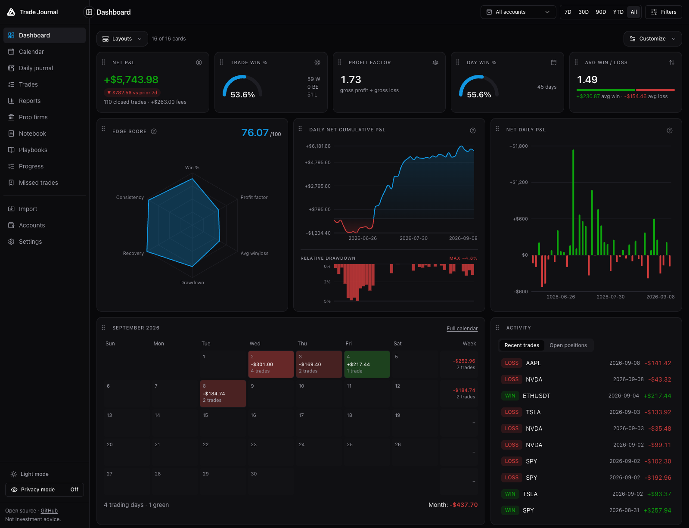
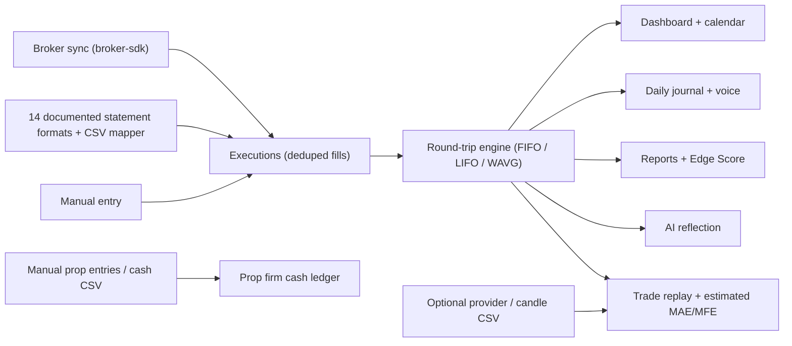
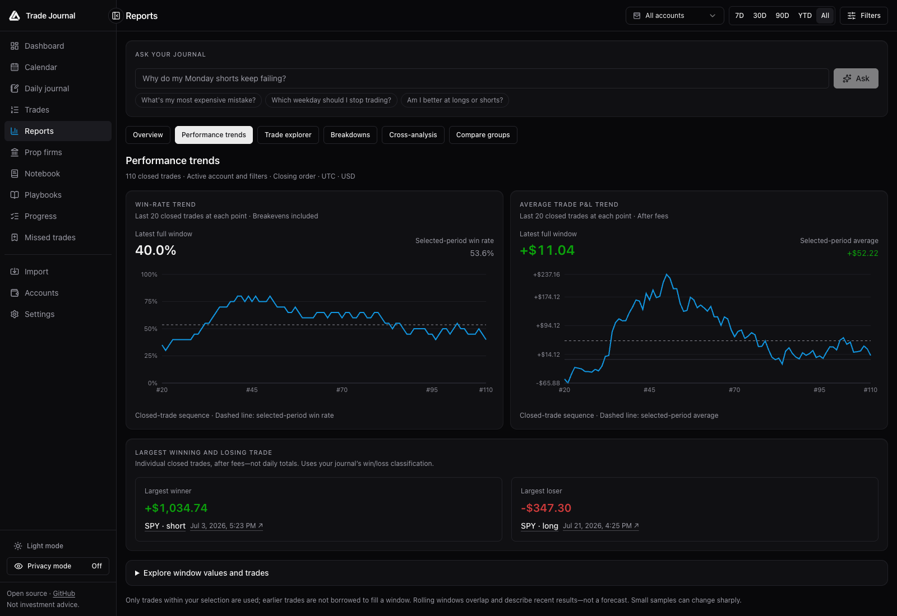
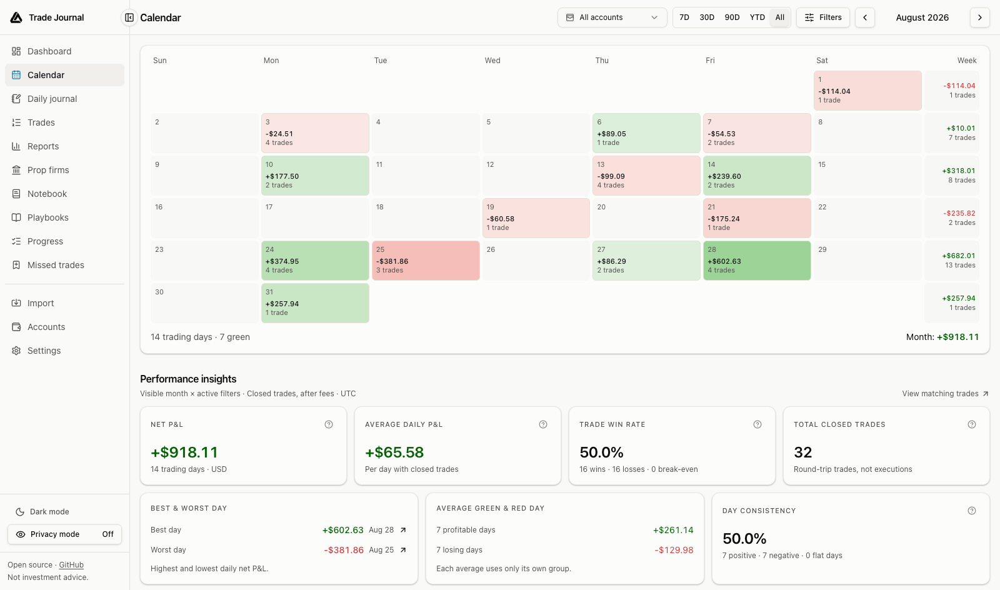
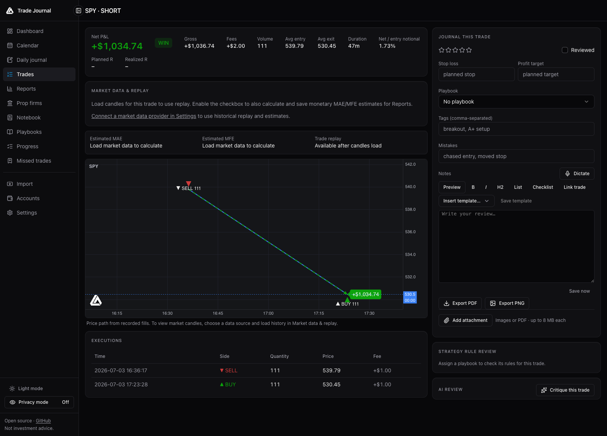
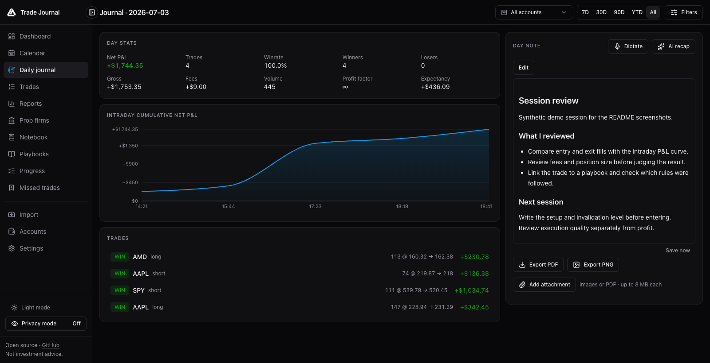
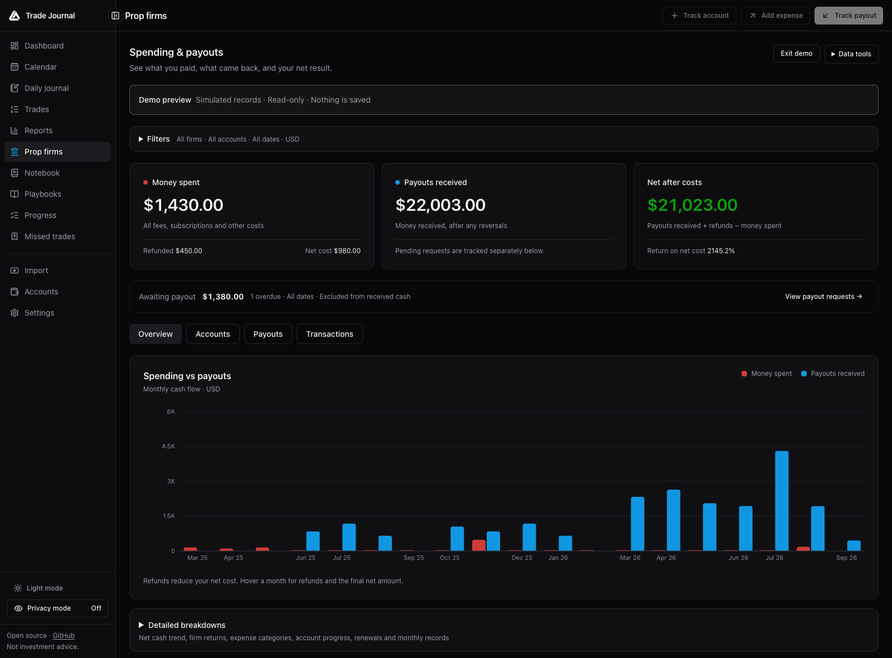

<div align="center">


<br/>

Broker sync, deep analytics, a P&L calendar, trade replay, prop firm tracking, daily journaling with voice dictation, and AI reflection. Run it locally, or use it free inside LuxAlgo.

Trade Journal is a [LuxAlgo](https://luxalgo.com) open-source project. Official repository: [github.com/LuxAlgo/trade-journal](https://github.com/LuxAlgo/trade-journal)

[](https://www.npmjs.com/package/@luxalgo/journal-core)
[](LICENSE)
[](packages/core/src/types.ts)
[](#quickstart)

[Quickstart](#quickstart) · [Features](#features) · [Screenshots](#screenshots) · [How it works](#how-it-works) · [Migrate](#migrating-from-tradezella-or-tradervue) · [Edge Score](docs/edge-score.md) · [Contributing](CONTRIBUTING.md)

</div>

---

**Record every trade. See what actually works.** Connect a broker, drop in a statement export, or add trades manually from the dashboard. Trade Journal rebuilds your history into round-trip trades, a P&L calendar, deep analytics, and a daily journal you can type, dictate, or ask questions of with your own AI. Your journal lives in a local SQLite database; broker sync, market data, and AI connect to the services you choose.



_Dashboard with generated demo data. All screenshots below use synthetic records, not a real trading account._

> ⚠️ **Early release.** APIs and schema may still move before 1.0. Parser validation varies by format, from synthetic fixtures to cross-checked field sources; per-format status lives in [docs/importers.md](docs/importers.md).

## Quickstart

> **Prefer not to self-host?** A free hosted journal is available inside [LuxAlgo](https://app.luxalgo.com), alongside Quant Charts. Everything below is for running your own copy; this README describes the code in this checkout. See the [platform announcement](https://www.luxalgo.com/blog/luxalgo-charting-platform/) for hosted product context.

```bash
git clone https://github.com/LuxAlgo/trade-journal
cd trade-journal
pnpm install --frozen-lockfile
pnpm dev
# http://localhost:3000
```

Requirements: **Node 22+** and **pnpm 11.0.8** (the version pinned in `package.json`). First run creates the SQLite database and applies additive schema upgrades automatically. No migration tool, no setup wizard, no account. With the commands above, local data lives in `apps/web/data/`.

For smooth everyday use or UI reviews, stop the development server and run `pnpm preview`.
This builds the app once, then serves the optimized production version at the same address,
using the same local data. Unlike `pnpm dev`, it does not compile each page on its first
visit or hot-reload code edits. After code changes, stop it and rerun `pnpm preview` to
rebuild; use `pnpm start` to reuse an existing build. Switch back to `pnpm dev` when editing.
Run only one mode at a time, since development and production share the build directory.

### Try it with demo data

On an empty dashboard, choose **Load demo data** to create a separate demo account with about 90 days of generated trades. You can remove that account later in **Accounts**.

To try statement import, use [`docs/samples/demo-trades-tradingview.csv`](docs/samples/demo-trades-tradingview.csv) in **Import → File upload**. It contains synthetic TradingView paper-trading fills across 13 symbols, from March 2025 through September 2026. Review the detected format, timezone, warnings, and preview before importing.

The **Prop firms** page has its own **Load demo data** button: a read-only simulation of fictional firms, evaluation costs, and payouts. That preview stays in browser memory and does not write financial records.

### Docker

```bash
docker compose up -d
# http://localhost:3000, data persisted in ./data on the host
```

### Configuration (all optional)

| Env var             | Effect                                                                                                   |
| ------------------- | -------------------------------------------------------------------------------------------------------- |
| `JOURNAL_PASSWORD`  | Require a password; recommended when accessible beyond localhost                                         |
| `JOURNAL_SECRET`    | Encryption key source for credentials at rest (default: generated key file in the data dir)              |
| `JOURNAL_DATA_DIR`  | Database, attachments, and local encryption key directory (default `./data` relative to the app process) |
| `ANTHROPIC_API_KEY` | Anthropic AI key via env instead of the Settings page                                                    |
| `OPENAI_API_KEY`    | OpenAI AI key via env instead of the Settings page                                                       |

Set these in the process environment or in `apps/web/.env.local` for local Next.js runs; the root [`.env.example`](.env.example) documents the optional values. For Docker, configure the service environment in [`docker-compose.yml`](docker-compose.yml).

For AI, open **Settings → AI**, select **Anthropic** or **OpenAI**, enter your API key, and choose **Save AI settings**. OpenAI defaults to `gpt-4.1-mini`; you can enter another text model ID available to your account. Each provider keeps its own encrypted key and model choice. Existing Anthropic settings continue to work. An OpenAI-only environment setup selects OpenAI automatically; with both keys present, Anthropic remains the default until you save a provider choice. Environment keys override saved keys and must be changed on the server. Saving settings does not make a model request or verify account access.

Deploy anywhere a Node process and a persistent disk exist: Docker, Railway, Fly.io, a small VPS. Serverless platforms without a disk need an external database, which this release does not support. SQLite on disk is the point.

Optional historical market data powers estimated MAE/MFE and candle replay on closed trades, with Vela rendering the charts. Configure a connection or upload candle CSVs in **Settings → Market data**. No provider is enabled or selected by default. See [Market data and replay](#market-data-and-replay) below and the [market data guide](docs/market-data.md) for setup, calculation definitions, and coverage limits.

The **Prop firms** sidebar tracks evaluation/reset costs, refunds, payout requests, and actual receipts across your own firms and accounts. It includes cash ROI, partial payouts, reversals, renewal reminders, attachments, and generic CSV import/export. See [Prop firm tracking](#prop-firm-tracking) below and the [prop firm guide and research](docs/prop-firms.md) for workflows and metric definitions.

### Add a trade manually

Choose **Add trade** on the dashboard to open the entry form. Select or create a manual account, enter the symbol, and add your buy and sell executions with their date, time, quantity, price, and optional fee. Save an entry alone for an open position, or include the exit for a closed trade. Use **Add execution** for partial fills or additional legs. Dates and times use your device's timezone.

The optional **Notes** field supports Markdown and saves with the trade. When adding fills to an existing position, new notes append to its existing notes. After saving, the dashboard refreshes automatically. The same form is available under **Import → Manual**.

## Why this exists

A trade journal is two things: a **verified record** of what you actually did, and the **reflection** that turns that record into better trading. Trade Journal keeps the record on your own machine and opens the reflection layer to any tool you choose, including your own AI.

- **You control your connections.** Broker, market-data, and saved AI credentials are encrypted at rest with AES-256-GCM. Your server uses them to contact the provider you configure, without a LuxAlgo credential proxy.
- **Your numbers are auditable.** The [Edge Score](docs/edge-score.md) is a documented, versioned formula, not a proprietary black box. Every metric is open source and unit-tested.
- **Your journal is portable.** Export trades as CSV, journal records as JSON, and reviews as PDF or PNG. Back up the data directory to retain attachments and the full local state; see [Export and backup](#export-and-backup).

## How it works

One primitive drives everything: a raw **execution** (a fill). Executions come in from broker sync, statement imports, or manual entry; the round-trip engine turns them into trades; every surface reads from there.



## Features

|                          |                                                                                                                                                                                                                                                                                                                                                                                                                                                                                                                                                            |
| ------------------------ | ---------------------------------------------------------------------------------------------------------------------------------------------------------------------------------------------------------------------------------------------------------------------------------------------------------------------------------------------------------------------------------------------------------------------------------------------------------------------------------------------------------------------------------------------------------- |
| **Broker sync**          | Read-only sync via [`@luxalgo/broker-sdk`](https://github.com/LuxAlgo/broker-sdk): Alpaca, Binance, Bybit, Coinbase, Kraken, OKX, Tradier, IBKR Flex, Hyperliquid, Questrade, Topstep, Trading212, Webull, Crypto.com, E*TRADE, and Public. Connect forms render straight from SDK metadata.                                                                                                                                                                                                                                                               |
| **Statement import**     | **14 documented formats**, auto-detected: **TradeZella** and **Tradervue** (CSV migration), TradingView (paper and strategy exports), MetaTrader 4 and 5, ThinkorSwim, IBKR (activity + Flex), NinjaTrader, Tradovate, TopstepX, Webull, DAS Trader, plus a column mapper for any other CSV. Matching execution records dedupe within an account; review warnings and skipped rows before committing an import. Have an export we don't recognize? Open an issue with an anonymized sample; real files are the most useful contribution this repo can get. |
| **Round-trip engine**    | Flat-to-flat position cycles from raw fills. FIFO / LIFO / weighted-average per account. Partial fills, scale-ins, flips, futures multipliers. Annotations survive rebuilds.                                                                                                                                                                                                                                                                                                                                                                               |
| **Analytics**            | Net/gross P&L, win and day-win rates, profit factor, expectancy, R multiples, streaks, drawdown and recovery, profit concentration, duration/time-of-day/weekday performance, per-symbol/tag/mistake/playbook breakdowns. Advanced filters on every dimension, comparison groups, and a two-way cross-analysis matrix. Reports also include rolling performance trends and a trade explorer scatter plot, with saved MAE/MFE estimates where available.                                                                                                    |
| **Dashboard**            | P&L calendar with weekly totals, cumulative and daily P&L, gauges, the open **Edge Score v2** radar, open positions, time-of-day performance. Drag cards to rearrange, hide what you don't use, save named layouts. Calendar insights highlight daily patterns. Light/dark themes, a collapsible sidebar, and mobile navigation support smaller screens.                                                                                                                                                                                                   |
| **Trade pages**          | Charted on [Vela](https://www.npmjs.com/package/@luxalgo/vela) with entry/exit markers and P&L labels: fill paths from recorded executions, optional user-selected market candles, and trade replay. Estimated MAE/MFE, running P&L, executions, ratings, stops/targets, tags, mistakes.                                                                                                                                                                                                                                                                   |
| **Daily journal**        | Day stats, intraday P&L curve, autosaving Markdown notes with templates and attachments (images, PDFs). Type them or **dictate** them with browser speech recognition (no journal API key required; browser support and speech processing vary).                                                                                                                                                                                                                                                                                                           |
| **Notebook & playbooks** | Folders, search, tags, trade links; named setups with rule checklists scored per trade, with adherence and followed-vs-broken performance in Reports.                                                                                                                                                                                                                                                                                                                                                                                                      |
| **AI reflection**        | Bring your own Anthropic or OpenAI API key: session recaps, per-trade critiques, "ask your journal" over your own aggregates. Key encrypted at rest; requests go from your server to the model, nowhere else.                                                                                                                                                                                                                                                                                                                                              |
| **Routines & misses**    | Pre-, during- and post-session routines with weekday schedules and a 13-week history; a missed-opportunity log kept out of your trading metrics.                                                                                                                                                                                                                                                                                                                                                                                                           |
| **Journal defaults**     | Configure breakeven tolerance, plus fee and stop/target rules per account and symbol; set timezone and contract multipliers for consistent calculations.                                                                                                                                                                                                                                                                                                                                                                                                   |
| **Prop firms**           | Evaluation and reset expenses, refunds, payout requests, partial receipts, reversals, cash ROI, account phases, renewal reminders, attachments, and generic cash CSV import/export. Separate from trade P&L.                                                                                                                                                                                                                                                                                                                                               |
| **Privacy & export**     | Privacy mode masks every monetary value (charts keep their shape) and persists across tabs. Trades export to CSV, reviews to PDF or PNG, and journal records to JSON; credentials, candle datasets, and attachment binaries are excluded from that export.                                                                                                                                                                                                                                                                                                 |

## Screenshots

Captured from the local app with generated demo trades and fictional prop firm records. Expand a view to inspect it at full width.

<details>
<summary><strong>Reports — rolling performance trends</strong></summary>



Compare recent rolling results with the full trading history. Reports also offer a trade explorer, breakdowns, comparison groups, and cross-analysis.

</details>

<details>
<summary><strong>Calendar — daily results in light mode</strong></summary>



Review trading days and weekly totals, then open a day to inspect its trades and journal.

</details>

<details>
<summary><strong>Trade detail — executions and review</strong></summary>



This chart shows a path between generated execution prices. Provider candles and replay are separate, optional inputs; no live market history is pictured here.

</details>

<details>
<summary><strong>Daily journal — notes beside the day's trades</strong></summary>



Keep notes, templates, attachments, and linked trades together with the day's results.

</details>

<details>
<summary><strong>Prop firms — costs, payouts, and cash returns</strong></summary>



A separate cash ledger tracks what you spent and actually received, with pending payouts shown separately.

</details>

## Market data and replay

Trade pages initially show recorded fills. Opening a trade or Reports does **not** automatically request market history.

Choose an optional connection in **Settings → Market data**: **London Strategic Edge, Alpaca, OANDA, Binance, Coinbase**, or **Market data CSV**. Provider access, instruments, feeds, and quotas depend on your account; the journal ships no credentials or provider history. Candle uploads use their own OHLCV format, separate from trade statement imports.

On a closed trade, choose the source, exact symbol, and resolution, then select **Load market data**. Replay offers restart, play/pause, stepping, speed, and scrubbing. Confirm the instrument, price basis, and currency before calculating monetary excursions; derivatives also need a contract multiplier.

**MAE/MFE are estimates from observed candles and executions**, not tick-perfect values. They include scaling and partial exits, exclude fees and currency conversion, and remain unavailable when coverage or required inputs are missing. Option-contract history and reversing fills spanning multiple position cycles are currently unsupported. Saved valid estimates can be explored in **Reports → Trade explorer**; batch calculation is an explicit action and can be stopped. Recorded fills and realized P&L remain unchanged.

See the [market data guide](docs/market-data.md) for provider configuration, CSV schema, replay behavior, and calculation limits.

## Prop firm tracking

Track evaluation, verification, funded, instant-funded, and live accounts across your own firms. Keep resets and phase changes as linked records, with expenses, refunds, supporting attachments, and an audit history.

Payout requests and approvals are separate from actual receipts. Partial payments and reversals flow into cash totals on their receipt dates; **cash ROI uses money received and costs paid**, not nominal account size or trading P&L. Currency totals stay separate. Renewal reminders appear in the tracker; they do not charge money or send background notifications.

Use the documented generic CSV template to preview and import expenses, refunds, and money already received. Export filtered cash movements to CSV or the full tracker records with the journal's JSON export. This is a local tracker, with no automatic bank or prop firm sync and no payout-eligibility engine. See the [prop firm guide](docs/prop-firms.md) for workflows, formulas, and import rules.

## Migrating from TradeZella or Tradervue

Export a supported CSV and open **Import → File upload**. Choose the destination account and timezone, inspect the detected format and preview, then import. Unknown headers go to a column mapper; review warnings, errors, and skipped rows before saving.

**Settings → Journal** has separate **Display timezone** and **Default import timezone** fields. Use the broker statement's zone for imports and your preferred zone for trade times, analytics and journal days. Each file can override its statement timezone; the preview shows converted execution times before saving. Existing timestamps are unchanged by settings edits. See [timezone setup and correcting earlier imports](docs/importers.md#statement-and-display-timezones).

- **TradeZella:** trade-level rows become one entry and one exit at the reported average prices. Where the reconciliation check permits it, the difference between price-implied P&L and stated net P&L is folded into fees to preserve the stated result to the cent. Large discrepancies, including contract-multiplier cases, can skip that reconciliation; compare totals with your source export.
- **Tradervue:** the supported generic fill CSV imports executions directly, including the documented fee fields. It does not need trade-level reconstruction.
- **Reconstruction limits:** an average-price trade export cannot recover original partial fills or the intratrade price path. MetaTrader 5 deal reports and TradingView strategy exports have their own source and validation rules. The currently documented MT5 formats are HTML/CSV, not XLSX.

See [supported formats and validation status](docs/importers.md). Have an export we do not recognize? An anonymized sample and its export settings help us validate support.

## Export and backup

**Settings → Export JSON** includes accounts (without credentials), executions, trades and annotations, daily journal entries, notebook folders and notes, templates, playbooks and rule checks, routines, missed trades, journal defaults, prop firm records and their audit history, and attachment metadata. Trades also export as CSV; review exports support PDF and PNG.

JSON export excludes credentials, candle datasets, saved market-data estimates, and attachment binaries, and there is no general JSON restore importer in this release. For a complete local backup, stop the app and copy the entire data directory, including attachments and the hidden `.secret` file if generated. If you supply `JOURNAL_SECRET`, retain that value separately so encrypted credentials remain readable. Keep original candle CSVs as well.

Default locations: `apps/web/data/` for the pnpm commands above, or the host's `./data` bind mount for Docker. `JOURNAL_DATA_DIR` overrides the app's path.

## Monorepo layout

| Package                                    | What it is                                                                                                                        |
| ------------------------------------------ | --------------------------------------------------------------------------------------------------------------------------------- |
| [`packages/core`](packages/core)           | `@luxalgo/journal-core`: pure domain engine (round trips, metrics, calendar, Edge Score). No IO, no framework, fully unit-tested. |
| [`packages/importers`](packages/importers) | `@luxalgo/journal-importers`: statement parsers + migration importers. Zero-dependency CSV/HTML parsing.                          |
| [`apps/web`](apps/web)                     | The app: Next.js 15, SQLite (Drizzle), Tailwind, Recharts/ECharts, Vela charting, TanStack Table, ai-sdk.                         |

### Use the engine in your own app

The math and importers are plain packages on npm, with no framework and no IO:

```bash
npm install @luxalgo/journal-core @luxalgo/journal-importers
```

The example below targets the workspace APIs in this checkout; published npm versions may lag behind.

```ts
import { buildRoundTrips, computeMetrics, computeEdgeScore } from "@luxalgo/journal-core";
import { parseAuto } from "@luxalgo/journal-importers";

const parsed = parseAuto(csvText, { timeZone: "America/New_York" });
if (!parsed) throw new Error("Unrecognized format: offer a column mapping.");
if (parsed.errors?.length) throw new Error(parsed.errors.join("\n"));
if (parsed.needsSymbol) throw new Error("Supply the missing symbol and parse again.");
// Review parsed.warnings and parsed.skippedRows before saving.
const executions = parsed.executions.map((fill) => ({
  ...fill,
  id: crypto.randomUUID(),
  accountId: "my-account",
  source: "import" as const,
}));
const trades = buildRoundTrips(executions, { method: "fifo" });
const metrics = computeMetrics(trades, { timeZone: "America/New_York" });
const edge = computeEdgeScore(metrics);
```

```bash
pnpm test          # tests for the core, importers, and app logic
pnpm typecheck     # all packages
pnpm format:check  # prettier
pnpm build         # production build
```

## Principles

MIT. No journal analytics or tracking service. The self-hosted journal stands alone; the hosted journal inside LuxAlgo is a separate service built on the same open engine. LuxAlgo integrations are optional bridges, never dependencies. Sanctioned APIs only.

External requests serve the features you choose: broker sync, market history, and Anthropic- or OpenAI-powered reflection. Browser dictation may use the browser vendor's speech service ([browser speech recognition behavior](https://developer.mozilla.org/en-US/docs/Web/API/SpeechRecognition)). Next.js has its own [framework telemetry setting](https://nextjs.org/telemetry); set `NEXT_TELEMETRY_DISABLED=1` to disable it when running or building the app.

## Disclaimer

Trade Journal reports and analyzes what your broker reports. Nothing it computes or generates (including AI recaps, critiques, and answers) is investment advice, and no metric predicts future results. Verify important numbers against your broker's own statements.

## License

Code is licensed under [MIT](LICENSE) © [LuxAlgo Global, LLC](https://luxalgo.com). The project name and LuxAlgo marks are covered by the [trademark policy](TRADEMARKS.md). Security reports: see [SECURITY.md](SECURITY.md).
